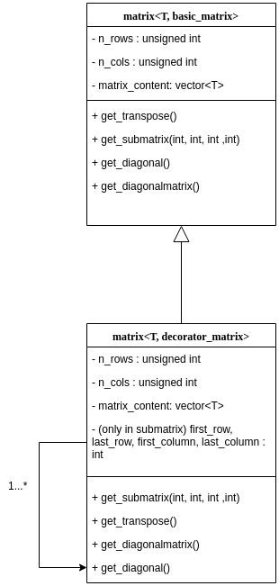

# Requirements
**Due date: 25/11/2018**

Implement a templated library handling matrices, vectors, and covectors; where vectors are $n \times 1$ matrices and covectors are $1 \times n$ matrices.

The library must offer operations like:

* **submatrix**: return a matrix that contains a contiguous subrange of rows and columns of the original matrix
* **transpose**: return a matrix with rows and columns inverted
* **diagonal**: return a vector containing the diagonal elements of a given matrix
* **diagonalmatrix**: return an unmodifiable diagonal matrix whose diagonal elements are those of a given vector

The matrices returned by such operators must share the data with the original matrix, but direct copy of the matrices and vectors must result in a deep copy (sharing a matrix can be obtained by taking a submatrix extending the whole row and column ranges).

Create iterators for the matrix traversing it either in row-major or column-major order. Any matrix should be traversable in either direction regardless of its natural representation order. Any given iterator will traverse only in a given order.


# Analysis of the task
## Definition of a matrix
First of all, it's worth noting that both vectors and covectors are simply considered as matrices, since vectors are $n \times 1$ matrices and covectors are $1 \times n$ matrices.

A matrix is defined by three main pieces of information:

* the **number of rows**, i.e. the height of the matrix
* the **number of columns**, i.e. the width of the matrix
* the **content of the cells**, i.e. the data that's contained inside of the cells of the matrix


Since the number of rows and columns is integer and must be positive ($\ge 0$), the variables `n_rows` and `n_cols` are of type `unsigned int`.

Being the number of rows and columns constant, a matrix can be represented using a one-dimensional `vector` (or `array`) *modulo* `n_cols` instead of relying on a native two-dimensional structure. This lets us reuse the iterators defined for `vector` instead of reinventing the wheel.

On the other hand, the content of a matrix must be shared with the content of the matrices derived from it, meaning that dealing with the actual values inside the matrix needs to be done through some solution that lets us share the pointer to the data structure. A `shared_pointer` lets us do the trick, as it is created in constructors using the `make_shared` function; hence, the "actual" vector of data representing the matrix is shared among all the decorations of a given matrix.


## Assumptions
While developing this project, I had to make some assumptions. The first and strongest one is that the available memory is enough to create the required objects. In particular, the vector's allocation could possibly deal with a large number of elements, leading to the failure of the memory allocation process.

Another assumption I had to make (and tried to enforce using `assert`) is that users will try to do legit operations, i.e. no *out of range* operations, wrongly called constructors and similar.

I also had to assume that there exists a default constructor for any data type that will be used as content of the matrix. This is not a strong assumption, but still requires quite some attention especially when dealing with custom data types;


## Design patterns
The relationships between the various kinds of matrices has to be analyzed. In particular, some possible choices might be:

* using the **Strategy** design pattern to choose the correct algorithm depending on the type of matrix we are using;
* using the **Decorator** design pattern to *decorate* the basic matrix into more and more "decorated" types (e.g. transpose of a submatrix of a matrix);
* avoid using any design pattern and heavily rely on a "standard" hierarchy of subclasses.

{height=300px}

In my implementation, I decided to use the Decorator pattern because the concept of *decoration* provides an intuitive analogy to be used in the program's logic and eases the developer's life when it comes to "aggregate" decorations (e.g. make a diagonal matrix from the transpose of a submatrix).

Let's assume the user needs to take the `diagonal` of a `submatrix` of a `transpose`.
The use of the decorator pattern is useful because it "delegates" the operations to the matrix that has been decorated, hence resulting in a clean code structure and in the possibility to build complex chains of operations exploiting the fact that new matrices are being created following the required sequence of operations.


## Matrix: basic and decorated
### Basic matrix
The basic matrix consists in a simple matrix with no decoration whatsoever.
This matrix is described by the data-type contained in its cells (i.e. `T`) and by its "special" type (i.e. `basic_matrix`).

Whenever we define a matrix without specifying its type, the matrix is a `basic_matrix` by default.

This means that writing `matrix<int>` is the same as declaring `matrix<int, basic_matrix>`.


### Decorated matrices
The decorated matrices rely on some templated empty classes: `submatrix`, `diagonal`, `diagonalmatrix` and `transpose_matrix`. Their templated parameter `decorator_matrix` represents the type of the matrix that's being decorated: this might be a simple `basic_matrix` or a much more complex matrix, for instance the transpose of the diagonal of a submatrix.

Some examples are: \small

```c++
matrix<int>a;
matrix<int,transpose_matrix<basic_matrix>>b=a.get_transpose();
matrix<int,diagonal<transpose_matrix<basic_matrix>>>c=b.get_diagonal();
```
\normalsize

#### Transpose
Calling the `get_transpose` method on a matrix returns the transpose of that matrix. The transpose is simply obtained by taking the matrix and logically swapping rows and columns: row iterators and column iterators are exchanged, the direct access operator automatically swaps the column number and the row number and so on. This saves us much time since we can rely on an already written logic.

#### Submatrix
Calling the `get_submatrix` method on a matrix requires 4 arguments: first row, last row, first column, last column. Note that the last row/column are excluded from the submatrix, i.e. the intervals taken are closed on the "begin" side and open on the "end" side.

Following the logic of the transpose, the submatrix relies on the matrix from whom it is built for almost all operations: for instance, the `operator()` relies on (and "shifts") the decorated matrix's `operator()`.

\clearpage

#### Diagonal
Given a $n \times m$ matrix, it consists on:

* the $n \times n$ matrix's diagonal, if $n \le m$
* the $m \times m$ matrix's diagonal, otherwise

Calling the `get_diagonal()` method returns a vector (i.e. a $n \times 1$ matrix) whose elements are the ones of the diagonal of the matrix the method is called on.

Iterating this vector by column, we obtain a single column representing the vector (i.e. the matrix); iterating by row, we obtain $min(n, m)$ (see definition above) rows made of a single element.


#### Diagonal Matrix
Called on a vector (i.e. a $n \times 1$ matrix, for example the one returned by `get_diagonal()`), the method `get_diagonalmatrix()` returns a square, immutable, diagonal matrix whose diagonal elements are the ones of the given vector, while all the other elements are zero (in general, the "null element").
Note that every decoration applied to a diagonal matrix leads to an immutable matrix, since operations would rely on the `diagonalmatrix`'s ones (which are `const`).


## Memory sharing
Sharing the memory is done through a `shared_ptr`. This provides a very powerful tool to apply changes even to "temporary" variables.

Let's assume we have a `matrix<int> A`  of size `6 x 7`. Since the decorated matrices share the memory with the original ones, calling `A.get_transpose().operator()(1, 1) = 500` changes matrix A even though the temporary transpose matrix gets deleted. BE CAREFUL!

Also, notice that heavy use or Return Value Optimization (RVO) is made, especially when decorating matrices. This also allows us to avoid defining a move constructor! 

Lastly, the `operator=` is not redefined for iterators to enforce the creation on new ones every time one is needed, in order to try and avoid the use of not-valid-anymore iterators.

## Iterators
Iterators and the relative `const` variants are provided.

In particular, they are defined in such a way that a matrix can be traversed either row-wise or column-wise, only going forward. The row iterator is the standard one (i.e. a \[row\] iterator is returned when the methods `begin()` and `end()` are called on a matrix). 

Heavy use of function overloading lets the user get different iterators using the same methods: it is always possible to **iterate the single row/column** and it is also possible to **iterate the whole matrix** by row using the standard `begin()` and `end()` methods.
Iterating over columns can be done only by single column; this means that iterating the whole matrix by column requires a `for` loop.


### Output stream operator
The **output stream operator** `<<` is redefined so that printing a matrix is as easy as calling `std::cout << my_matrix;`. The `<<` operator relies on \[row\] `iterators` to print the matrix, iterating over the single rows and printing each row (and printing a newline after each row has ended). 


## Tests and library usage
Some tests are provided in the `matrix.cpp` file.

In particular, creating a `basic_matrix` (i.e. the "base" of all the decorations) can be done by using `matrix<T>`, with T $\in$ {int, char, std::string, ...}.

The decorated matrices, on the other hand, are created, starting from another matrix, with the functions:

* `get_transpose`
* `get_diagonalmatrix`
* `get_diagonal`
* `get_submatrix`
    * this requires four arguments: first line, last line (excluded), first column, last column (excluded)

Note that these decorated matrices **must** be created starting from a `basic_matrix`.

Here are some lines of code that use the library:

```c++
...
matrix<int> b(8, 10);
for (unsigned int i = 0; i < b.get_rows(); i++)
    for (unsigned int j = 0; j < b.get_cols(); j++)
        b(i, j) = i + j;
auto c = b.get_submatrix(0, 5, 1, 4);
auto d = c.get_diagonal();
auto f = d.get_diagonalmatrix();
auto l = f.get_transpose();
std::cout << d << std::endl << l << std::endl;
...
```


# Other information
## Compilation
The project was built using a Makefile running this command:

\small
`g++ -Wall -pedantic -Wextra -pedantic-errors matrix.cpp -o matrix.exe`
\normalsize

The compilation process was tested both in g++ 7.3.0 and clang++ 6.0.0.

### Makefile
A Makefile is made available to:

* compile the software: `make` (uses `g++`) or `make clang` (uses `clang++`)
* compile the project and run Valgrind on it (unnecessary, since there are no `new` statements): `make run_valgrind`
* build the documentation using *Doxygen* as per the Doxyfile specification: `make doc`
* building this PDF using *pandoc*: `make pdf`


## Continuous Integration and Version Control
This software has been tested using GitLab-CI and Travis-CI to automatically build the project every time a commit was pushed. The Travis configuration, along with all this project, is now available [here](https://gitb.com/lollones/matrix_cpp).

## Virtual methods, interfaces, ...
Having done this project on my own, I did not have the time to implement all the "formal" parts like abstract interfaces, virtual methods and so on.

# References
To build this project, I heavily used:

* the Professor's slides
* [stackoverflow.com](https://stackoverflow.com) (of course)
* [sourcemaking.com](https://sourcemaking.com)
* [This](https://github.com/LolloneS/cbuffer) project I made last year for another University course
* comparisons between my work and other colleagues' and friends' ones: knowledge must be shared!

I could never have done this project without all of them.